# Im2Mesh

This project offer a full framework for the 3D Cell Surface Reconstruction from Fluorescence Microscopy

<p>
  
  
  
</p>


# Installation

Before starting, we recommend [creating a new conda environment](https://docs.conda.io/projects/conda/en/latest/user-guide/tasks/manage-environments.html#creating-an-environment-with-commands) or a [virtual environment](https://docs.python.org/3/library/venv.html) with **Python 3.10+**.

```bash
conda create -y -n im2mesh -c conda-forge python=3.11
conda activate im2mesh
```

This project is implemented within our [Im2Im Transformation](https://github.com/MMV-Lab/mmv_im2im/tree/main) framework for training/inferece (only in the case of the Unet models).

```bash
pip install "mmv_im2im[all] @ git+https://github.com/MMV-Lab/mmv_im2im.git"
```

Clone the actuall repo and install the requirements

```bash
git clone https://github.com/MMV-Lab/im2mesh.git
cd im2mesh
pip install -r requirements.txt 
```


#  Base Dataset

For Training proposes we use the [nucleus morphological dataset](https://open.quiltdata.com/b/allencell/tree/aics/nuc-morph-dataset/) provided by the [Allen Institute](https://alleninstitute.org/)

In aim to get the data we provide the scrip based on the provided for the Allen Institute in the [official page](https://open.quiltdata.com/b/allencell/tree/aics/nuc-morph-dataset/).

```bash
python core/get_allancell_data.py 
```

This dataset contain the multi cell images and the corresponding sementation generated by watershed algorithm 

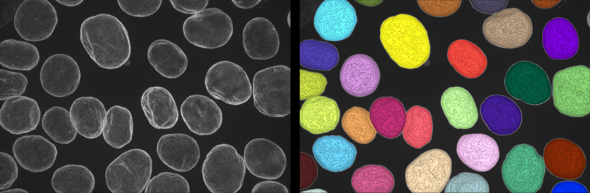

The original [nucleus morphological dataset](https://open.quiltdata.com/b/allencell/tree/aics/nuc-morph-dataset/) also provide some model segmentation but there are just 18 examples with smoother segmentations in comparation with the watershed, we inlcude the training option for use the [cellpose](https://github.com/MouseLand/cellpose) model.

# Cellpose Dataset (Optional)

To get and parse the data set ready for training with [cellpose](https://github.com/MouseLand/cellpose) just run:

```bash
python core/get_cellpose_training_dataset.py --path_files /path/to/the/raw/images
```

To run your own  [cellpose](https://github.com/MouseLand/cellpose) training, set your desired parameters and run:

```bash
python core/cellpose_training.py --train_dir /path/to/dataset --n_epochs 100 --learning_rate 1e-5 --weight_decay 0.1 --batch_size 4
```


We also provide the scrip that take the raw cell images and use [cellpose](https://github.com/MouseLand/cellpose) to generate segmentations, you can try the [pre-trained models](https://path/to/weight/will/be/here).

```bash
python core/cellpose_segmentation.py --input_path /path/to/raw/images/ --trained_model path/to/trained/model
```

# Architectures

## Explicit (spheric harmonic prediction + mesh prediction)

## Unet based architectures

We use a Unet like architecture (Attention/nn/Probabilistic) in order to learn the spherical harmonics decopisition for the mesh generation, it's called explicit due the posibility of obtain the coefficents of the decomposition, this models imposes no constraint on the spatial resolution of input volumes (variable shape training/inference).

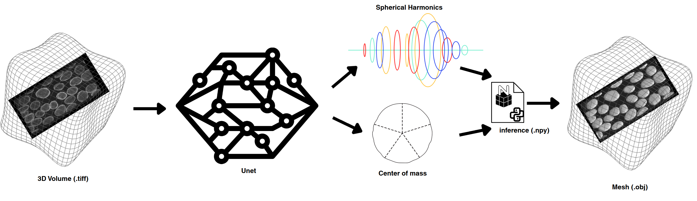

## HarmonicRegressionNet architecture

This model is designed to compress complex 3D spatial data into set of continuous numerical coefficients, this models imposes no constraint on the spatial resolution of input volumes (variable shape training/inference). It does this in three distinct phases: 

3D Feature Extraction, the network takes a 3D volume input and passes it through a series of 3D convolutional and residual blocks. Each step downsamples the spatial size while increasing the number of feature channels. Finally, global pooling and a fully connected layer condense the entire 3D space into a compact 1D latent vector. 

Harmonic Transformation Instead of passing the vector straight to the output, it enters a sequence of three HarmonicOscillatorLayers. This block remaps the latent features into a periodic, frequency-based representation space.

Final Regression, A standard linear layer maps these refined harmonic features directly to the final output vector. 

An harmonic oscillator describes a system that moves periodically (like a pendulum or a vibrating string), which is mathematically represented by sine and cosine waves.This architecture translates that physical concept into deep learning by replacing traditional activation functions with a sinusoidal activation function.

$x: y = \sin(\omega_0 \cdot (Wx + b))$

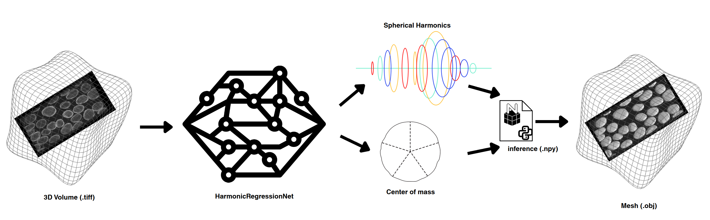

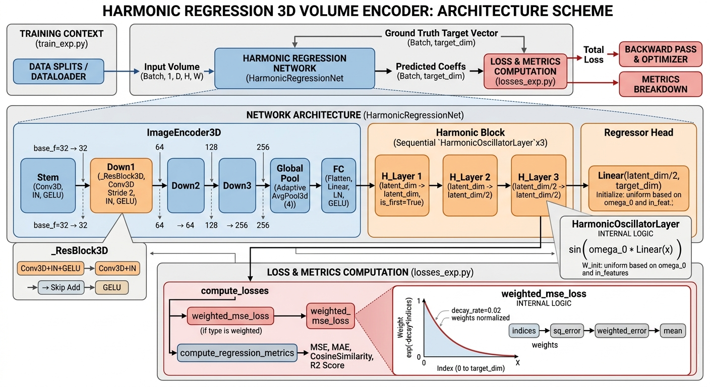

## Implicit (mesh prediction)

## HarmoMeshNet architecture

This offer a Physics-Informed model capable of learn the spheric decomposition in a implicit way that means that we don't have the explicit acces to the spherical harmonics coefficents, this allow us to predict directly a 3D mesh representation.

HarmoMeshNet reconstructs the 3D triangular mesh surface of biological cells directly from a fluorescence microscopy volume and imposes no constraint on the spatial resolution of input volumes (variable shape training/inference).

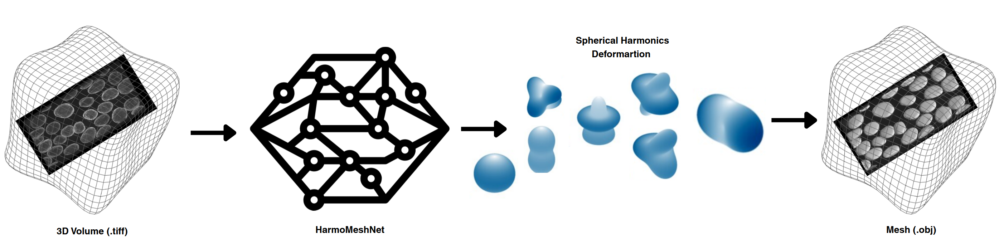

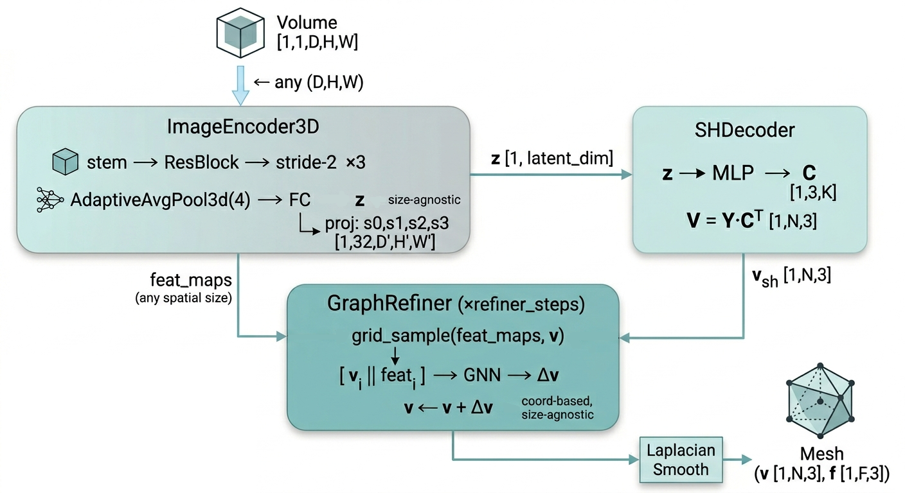

## Spherical Harmonic Surface Representation

Since `batch_size=1` is mandatory, the `--accumulate_grad_batches N` flag is
the only way to approximate a larger effective batch. 

Both input volumes and output meshes operate in a shared `[-1, 1]` coordinate
space. Ground-truth mesh vertices are normalised at load time:

$$\mathbf{v}_\text{norm} = \frac{\mathbf{v} - \frac{1}{2}(\mathbf{v}_\text{min} + \mathbf{v}_\text{max})}{\frac{1}{2}\,\text{max}(\mathbf{v}_\text{max} - \mathbf{v}_\text{min})}$$

This ensures that `grid_sample` coordinates computed from predicted vertex
positions remain within the valid sampling range.

Any smooth, star-shaped closed surface can be expressed over the unit sphere
$S^2$ using real spherical harmonics $\{Y_{lm}(\theta, \phi)\}$:

$\mathbf{r}(\theta, \phi) = \sum_{l=0}^{L} \sum_{m=-l}^{l} \mathbf{c}_{lm} \, Y_{lm}(\theta, \phi)$

In matrix form for $N$ canonical icosphere vertices:

$\mathbf{V} = \mathbf{Y} \, \mathbf{C}^\top, \qquad
  \mathbf{Y} \in \mathbb{R}^{N \times K}, \quad
  \mathbf{C} \in \mathbb{R}^{3 \times K}, \quad
  K = (L+1)^2$

$\mathbf{Y}$ is precomputed once and stored as a non-trainable buffer. The
decoder is a single matrix multiply — fast and analytically differentiable.

**Initialisation** via least-squares projection of the unit sphere:

$\mathbf{C}_\text{init} = (\mathbf{Y}^\top \mathbf{Y})^{-1} \mathbf{Y}^\top \mathbf{V}_\text{sphere}$

## Harmonic Oscillator Analogy

The Laplace–Beltrami operator on $S^2$ has the spherical harmonics as
eigenfunctions with eigenvalue $l(l+1)$:

$\Delta_{S^2} \, Y_{lm} = -l(l+1) \, Y_{lm}$

This eigenvalue is the spring constant in the harmonic oscillator analogy:
low-degree modes (global shape) are soft; high-degree modes (wrinkles) are stiff.
The mode energy regulariser:

$$\mathcal{L}_\text{mode} = \sum_{l=0}^{L} l(l+1) \, \|\mathbf{C}_l\|_F^2$$

is the $H^1$ Sobolev seminorm on $S^2$ — it penalises high-frequency surface
oscillations without forbidding them outright.

## Willmore Energy

The Willmore functional $\mathcal{W} = \int_\mathcal{S} H^2\,dA$ (squared mean
curvature integrated over area) is minimised by the round sphere. Discretely,
using the cotangent Laplacian $\mathbf{L}_\text{cot}$ from PyTorch3D:

$$\mathcal{L}_\text{Willmore} = \|\mathbf{L}_\text{cot} \, \mathbf{V}\|_F^2$$

since $(\mathbf{L}_\text{cot}\,\mathbf{V})_i \approx 2H_i\,\mathbf{n}_i$.


## Loss Functions

$$\mathcal{L}_\text{total} = w_\text{ch}\,\mathcal{L}_\text{Chamfer}+ w_\text{nc}\,\mathcal{L}_\text{normal}+ w_\text{el}\,\mathcal{L}_\text{edge}+ w_\text{ls}\,\mathcal{L}_\text{Laplacian}+ w_\text{W}\,\mathcal{L}_\text{Willmore}+ w_\text{me}\,\mathcal{L}_\text{mode}$$

| Term | Default weight | Description |
|---|---|---|
| $\mathcal{L}_\text{Chamfer}$ | 100 | Bidirectional point-cloud distance |
| $\mathcal{L}_\text{normal}$ | 50 | Normal consistency across adjacent faces |
| $\mathcal{L}_\text{edge}$ | 50 | Edge-length variance |
| $\mathcal{L}_\text{Laplacian}$ | 50 | Global Laplacian fairness |
| $\mathcal{L}_\text{Willmore}$ | 0.01 | Discrete $\int H^2\,dA$ — elastic shell energy |
| $\mathcal{L}_\text{mode}$ | 0.001 | $H^1$ Sobolev norm on $S^2$ |

---


#  Training Datasets 

## Explicit Dataset 

To generate the dataset used for train the explicit architectures the [raw/segmentation multicell](https://open.quiltdata.com/b/allencell/tree/aics/nuc-morph-dataset/) files are required and the dataset it's generated running:

Note: On the case of generate custome segmentations provide the corresponding paths to them. 

```bash
python core/generate_mesh_dataset.py --image_files /path/to/raw/images/ --segentation_files path/to/segmentation/files --only_full_cell --save_seg --save_mesh --correct_seg --p_testset 0.2
```

This generate the dataset and also the ```dataset_creation_log.txt``` file that contains some spatial information about the generated files and the ```global_info_dataset.txt```  with the global spatial information, useful for hyperparameter election:

```
📂im2mesh_dataset/
├── 📄 dataset_creation_log.txt
├── 📄 global_info_dataset.text    
├── 📂training_set/ 
  ├── 📂training_set/
      ├── 🖼️ img1_IM.tiff  # 3D volumes .tif / .tiff  (any spatial size)
      ├── 📄 img1_GT.npy   #spherical represemtation gt vector
├── 📂test_set/
      ├── 🖼️ img1_IM.tiff  # 3D volumes .tif / .tiff  (any spatial size)
      ├── 📄 img1_GT.npy   #spherical represemtation gt vector 
├── 📂meshes/
      ├── 📄 img1.obj  # GT surfaces(meshes) .obj / .stl / .ply / .vtk 
```

## Implicit Dataset

With the previous dataset  generated

We can generate the <b>harmmesh_dataset</b> for implicit model training, running:

```bash
python core/generate_harmmesh_dataset.py --dataset_file /path/to/generated_dataset 
```
This code will generate the following file system structure:

```
📂 harmmesh_dataset/   
├── 📂train/ 
  ├── 📂images/
      ├── 🖼️ img1_IM.tiff  # 3D volumes .tif / .tiff  (any spatial size)
  ├── 📂meshes/
      ├── 📄 img1.obj  # GT surfaces(meshes) .obj / .stl / .ply / .vtk
├── 📂test/
  ├── 📂images/
      ├── 🖼️ img1_IM.tiff  # 3D volumes .tif / .tiff  (any spatial size)
  ├── 📂meshes/
      ├── 📄 img1.obj  # GT surfaces(meshes) .obj / .stl / .ply / .vtk
```


# Training Models

## Explicit models

## Unet architectures

Three different architectures are currently ready for be trained (Attention_Unet/nn_Unet/Probabilistic_Unet) in order to train the corresponding [train yaml](./docs/yaml_configs) template files are provided, you can edit the desired training configuration, save the changes and run:

```bash
run_im2im --config /path/to/the/yaml
```

The output structure will produce a version_x folder (one for each training):

```
📂 lightning_logs/   
  ├── 📂version_x/ 
    ├── 📂checkpoints/ # weights of the model during training
        ├── 📄 weights_1.ckpt  
        ├── 📄 weights_n.ckpt
    ├── 📄 data_config.yaml # yaml files with the configuration used for training
    ├── 📄 model_config.yaml
    ├── 📄 train_config.yaml
    ├── 📄 hparams.yaml
    ├── 📄 events.out.tfevents # tf file with the logs for training plot visualization      
```


## HarmonicRegressionNet architecture

For training the model run the comand:

```bash
python core/train_HarmonicRegressionNet.py   --data_path path/to/dataset   --val_split 0.2   --optional_id initial_training   --n_start_filters 32 --latent_dim 512 --target_dim 2503 --lr 0.0001 --warmup_ratio 0.05 --warmup_lr_start 1e-06 --n_epoch 3000 --accumulate_grad_batches 6 --loss_type weighted_mse --ckpts_interval 10 --patience 90
```

The output structure :

```
📂 HarmonicRegressionNet_trainings/   
  ├── 📂training_id/ 
    ├── 📂ckpts/ # weights of the model during training
        ├── 📂 model/
            ├── 📄 best_model.ckpt  
            ├── 📄 model_epochn.ckpt
    ├── 📂logs/ # txt files with logs for training plot visualization 
        ├── 📄 train_epoch.txt
        ├── 📄 train_step.txt
        ├── 📄 val_epoch.txt 
    ├── 📄 inference_args.txt # model training configuration 
    ├── 📄 training_execution_config.txt # training configuration used     
```
## Implicit models

## HarmoMeshNet architecture

For training the model run:

```bash
python core/train_implicit_model.py   --data_path path/to/dataset   --val_split 0.2   --optional_id initial_training   --n_start_filters 32   --latent_dim 512   --max_sh_degree 8   --sphere_subdivisions 4   --refiner_steps 3   --refiner_layers 3   --refiner_hidden 64   --n_smooth 1   --lambd 0.5   --lr 0.0002   --n_epoch 3000   --accumulate_grad_batches 6   --ckpts_interval 10   --patience 90   --chamfer_scale 1.0   --normal_consistency_scale 0.05   --edge_length_scale 0.3   --laplacian_smoothing_scale 0.3   --willmore_scale 5e-05   --mode_energy_scale 0.0001   --num_workers 4
```

The output structure :

```
📂 HarmoMeshNet_trainings/   
  ├── 📂training_id/ 
    ├── 📂ckpts/ # weights of the model during training
        ├── 📂 model/
            ├── 📄 best_model.ckpt  
            ├── 📄 model_epochn.ckpt
    ├── 📂logs/ # txt files with logs for training plot visualization 
        ├── 📄 train_epoch.txt
        ├── 📄 train_step.txt
        ├── 📄 val_epoch.txt 
    ├── 📄 inference_args.txt # model training configuration 
    ├── 📄 training_execution_config.txt # training configuration used     
```

# Model Inference

## Explicit models

## Unet architectures

Having the model weights of your trained model, configure the [inference yaml](./docs/yaml_configs) and run:

```bash
python core/Unet_inference.py --yaml_inference /path/to/yaml --mode_prediction multicell2multicell --save_detection --only_full_cells 
```

## HarmonicRegressionNet architecture

The training [script](./core/train_HarmonicRegressionNet.py) generate the inference_args.txt file with the parameters need for the model configuration (same used for training).


For inference with the model run:

```bash
python core/HarmonicRegressionNet_inference.py --input_dir path/to/test/images/folder --weights_path path/to/trained/model/.pt --inference_mode multicell2multicell  --n_start_filters 32 --latent_dim 512 --target_dim 2503
```

## Implicit models

## HarmoMeshNet architecture

The training [script](./core/train_HarmoMeshNet.py) generate the inference_args.txt file with the parameters need for the model configuration (same used for training).

For inference with the model run:

```bash
python core/HarmoMeshNet_inference.py --input_dir path/to/test/images/folder --weights_path path/to/trained/model/.pt --inference_mode singlecell2singlecell/multicell2singlecell  --n_start_filters 32 --latent_dim 512 --max_sh_degree 8 --sphere_subdivisions 4 --refiner_steps 3 --refiner_layers 3 --refiner_hidden 64 --n_smooth 1 --lambd 0.5
```

# Inference Mode (options for inference)

In all the cases we allow three different behaviours during inference throught the ```--mode_prediction``` parameter: 

```multicell2singlecell```: You have volumes (Z,Y,X) with multiple cells but you want to generate the individual mesh for each individual cell.

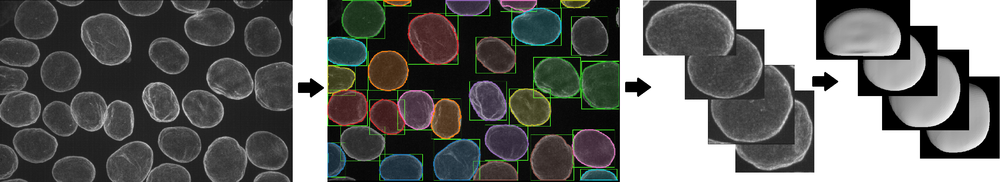


```singlecell2singlecell```: You have volumes (Z,Y,X) with a single cell and you want to generate the mesh of this cells.

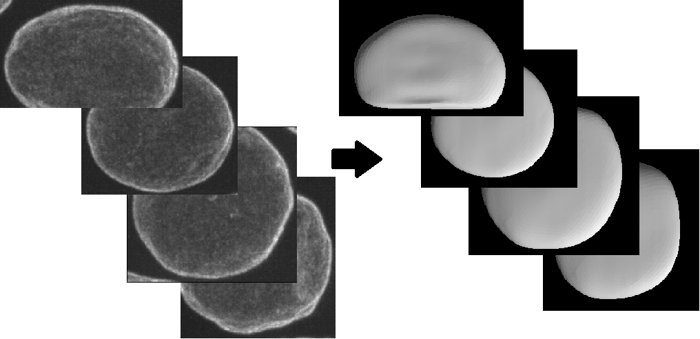

```multicell2multicell```: You have volumes (Z,Y,X) with multiple cells and you want to generate the mesh of this volumes.

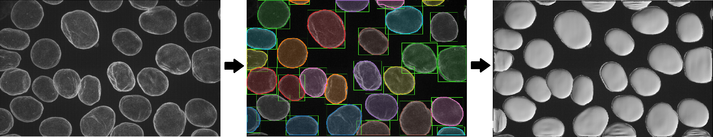

# Training loss plots

## Explicit models

## Unet architectures

Change your desired training version folder and run the command:

```bash
tensorboard --logdir=./lightning_logs/version_x
```

A Serving TensorBoard link will be provided copy and paste the url on the webpage and the plots will be deployed:

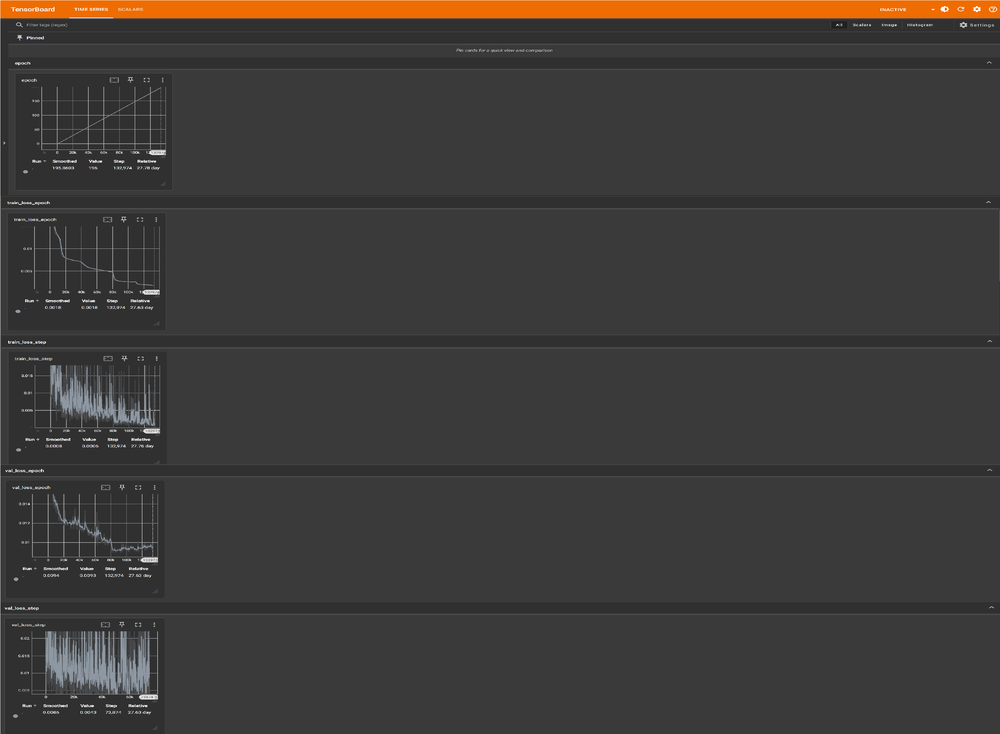


## HarmonicRegressionNet architecture

When the model is trained, the folder ```logs``` is generated with the .txt files containing the track of the metrics during the execusion for plot generation, run:

```bash
python core/plot_HarmonicRegressionNet_losses.py  --input_dir path/to/the/log/folder
```

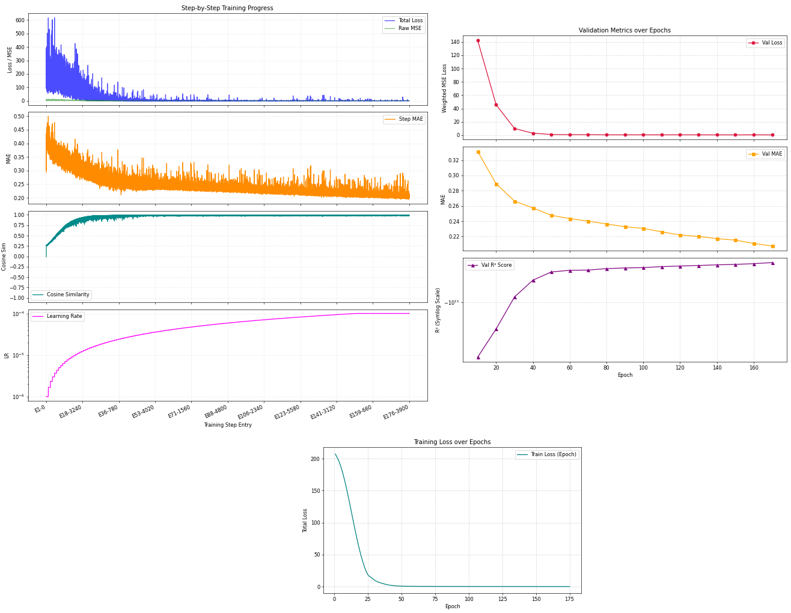

## Implicit models

## HarmoMeshNet architecture

When the model is trained, the folder ```logs``` is generated with the .txt files containing the track of the metrics during the execusion for plot generation, run:

```bash
python core/plot_HarmoMeshNet_losses.py  --input_dir path/to/the/log/folder
```

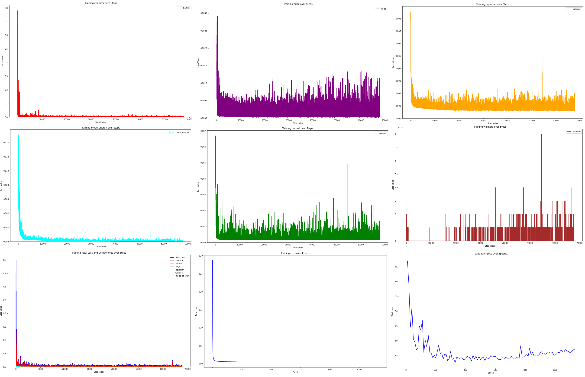


# Visualization Tools

To rendering the spheric harmonic descomposition and the correspondig mesh given the .npy file just run

```bash
python core/spherical_descomposition_visualization.py --path_file /path/to/file/.npy
``` 

This will show the corresponding rendering within [Vedo](https://vedo.embl.es/)

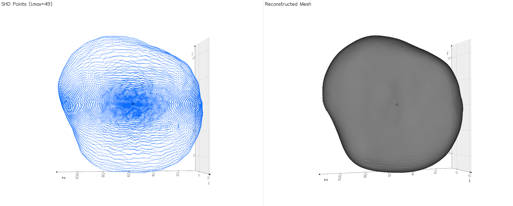


## Vector.npy to Mesh.obj

Given a folder with .npy files you can get the corresponding .obj files running:

```bash
python core/vector2Mesh.py --input_files path/to/.npy/folder
``` 

The generated .obj can be visualized  with help of [napari vedo bridge](https://vedo.embl.es/) just running napari whithin the ```im2mesh``` enviroment and drawing the file to the visualizer. 

```bash
(im2mesh) $user: napari
```

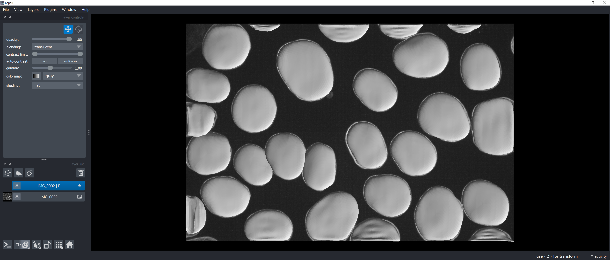

# ViewSTL

For a simple visualization of a single .obj mesh you can use the [ViewSTL](https://www.viewstl.com/#!) tool throught the web, just draw the desired file.


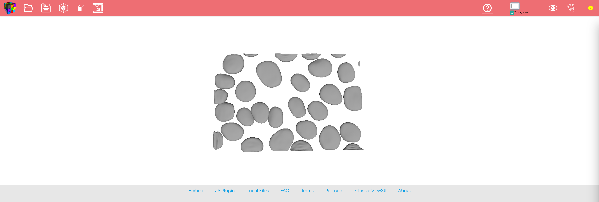


